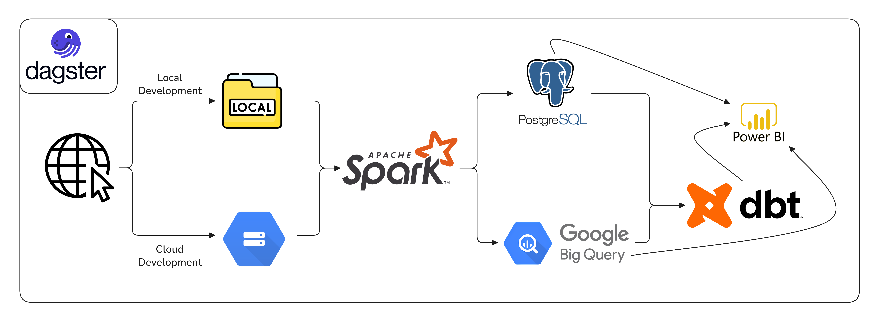

# 1000 Genomes Project Index Data ETL Pipeline

> This is an end-to-end pipeline designed to ingest and process index data created by the 1000 Genomes Project.



## About the 1000 Genomes Project

From January 2008 till 2015, an internationl research effort began to create the most detailed catalogue of human genetic variaton. The data is now publicly available, and is used to understand the diversity of the human genome. The project contains index data files that give more details on the projects file structure, as well as data on contributors to the project and the populations that have been sequenced.

While the genomic data itself is huge, the index data is much smaller and can be used to draw some insights on how the actual sequence data was collected, who were the major contributors, and how the sequencing was done in each population. This is the data that this pipeline will be handling.


## About the Pipeline

The pipeline is split into 2 parts.
1. **ETL Pipeline:** Utilizes python's simple requests package to download the index data along with pyspark to perform some basic cleaning and processing followed by data validations before they are uploaded to the database of choice.
2. **dbt Transformation:** This is where the heavy transformations are performed to organize the data into a star schema and create dashboard ready marts.

### Key Features
- **Database Management (Switchboard Architecture):** The pipeline can be easily configured to use any database of choice, and was designed to be easily switched between different setups. Currently tested on:
    - **Local Setup:** Best for testing purposes. Uses local file storage for raw data files and postgres as the database.
    - **Google Cloud Storage:** Uses GCS as the storage location for raw data files and BigQuery as the database.
- **Environment Isolation:** To avoid dependency conflicts, the pipeline was split into 2 virtual environments:
    - **Main Environment (Python 3.12):** Encompasses the ETL Pipeline, as well as the dagster orchestration setup
    - **dbt Environment (Python 3.11):** A small isolated environment for dbt to run without polluting the main environment.

## Getting Started

### Prerequisites (Some can be skipped if using the provided `Dockerfile`)
- OS: Tested on Ubuntu 22.04
- uv package: `curl -LsSf https://astral.sh/uv/install.sh | sh`
- Java: `sudo apt-get install default-jre-headless`
- Docker (for local development): Follow official installation instructions.
    - **Note** that if you will test this locally using postgres, you will need to initialize `docker-compose.dev.yaml` or have already installed postgreSQL on your machine..
- GCP Service Account (for cloud development)
- **Main Environment (Python 3.12):**
    - Installed in the root directory of the project
    - `uv sync`
- **dbt Environment (Python 3.11):**
    - Installed in the `dbt_project` directory of the project
    - `uv venv dbt_project/dbt_venv --python 3.11`
    - `uv pip install -r dbt_requirements.txt --python dbt_project/dbt_venv/bin/python`

## Configuration
- Create `.env` file in the root directory of the project, following the `.sample.env` template to fill out the needed variables and credentials, namely:
    - `DEFAULT_STORAGE_PLATFORM` & `DEFAULT_DB_PLATFORM` which will determine the nature of you resources (`local` or `cloud`).
    - `GOOGLE_APPLICATION_CREDENTIALS` & `GCP_PROJECT_ID` for configuring GCP resources and service account credentials.
- Create `src/config/databases.yaml`, following the `databases.yaml.example` template to fill out the needed variables and credentials.
    - The databases and storage locations can be easily expanded to hold multiple resources.
    - Look more into `src/db_connection/` to understand how the resources are being managed.
- Create/Edit `dbt_project/profiles.yml` if needed.

#### **Note on `Dockerfile`**
At this point, you are able to safely run the entire project using the given `Dockerfile` if you decided to do a test run without needing to setup everything manually or creating `uv` environments. This will also create a container where you can access dagster UI. But configuring `.env` and `databases.yaml` is still required.

```bash
docker build -t genome-pipeline:latest .

# .env file is needed to configure some environment variables
docker run -it --env-file .env -p 3000:3000 genome-pipeline:latest
```
If you run into an issue with DAGSTER_HOME, make sure to specify it manually during the run or comment out `DAGSTER_HOME` in `.env`.
```bash
# Ensure DAGSTER_HOME points to the container path, overriding local .env settings
docker run -it --env-file .env -e DAGSTER_HOME=/app/.dagster -p 3000:3000 genome-pipeline:latest
```

## Running Manually
if you choose to run the project manually (without `Dockerfile`), you can simply use the `Makefile` provided in the root directory to see how each step is executed.
```bash
make load_sequence_data
make load_population_data
make transform_data

# or all together
make run_pipeline
```

You can also launch the Dagster UI at the default port `localhost:3000` and start materializing assets manually.
```bash
uv run dagster dev -m orchestration
```


> **Note**: This project can be easily migrated to GCP using Cloud Run service, but I suggest keeping the service account key in google's secret manager for security.